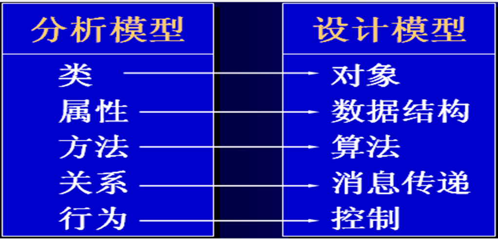
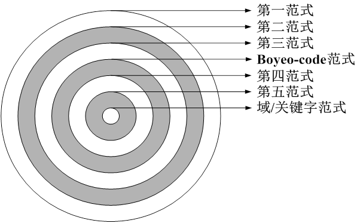

# 第七章 面向对象设计

分析：提取、整理用户需求，建立问题域精确模型。

设计：转变需求为系统实现方案，建立求解域模型。

## 一、面向对象设计准则及启发规则

### 1.1 面向对象设计准则

在实际的软件开发过程中分析和设计的界限是模糊的。

分析和设计活动是一个多次反复迭代的过程。

面向对象方法学在概念和表示方法上的一致性，保证了在各项开发活动之间的平滑（无缝）过渡，领域专家和开发人员能够比较容易地跟踪整个系统开发过程，这是面向对象方法与传统方法比较起来所具有的一大优势。

1. 抽象

   通过像**类**抽象机制实现

   提高可重用性

2. 信息隐蔽

   通过封装性实现

   提高独立性

3. 弱耦合

   对象间耦合：交互耦合、继承耦合

   **交互耦合：**对象间通过消息连接实现（**松散**）

   - 降低消息连接复杂度（减少参数个数，降低参数复杂度）

   - 减少信息数

   **继承耦合：**一般类和特殊类之间耦合。（**紧密**）

   有继承关系基类和派生类是系统中粒度更大模块。

4. 强内聚

   **服务内聚：**只完成一个功能。

   **类内聚：**一个类只有一个用途，否则分解。

   **一般特殊内聚：**设计合理，是对领域知识正确抽取。

5. 可重性

   - 尽量利用已有类（类库、已创建类）

   - 创建新类考虑以后可重用性

### 1.2 面向对象设计启发规则

1. 设计结果清晰易懂

   - 用词一致
   - 使用已有协议
   - 减少消息模式的数目
   - 避免模糊的定义

2. 一般-特殊结构深度适当

   约100个classes，则设计7+-2层

3. 设计简单class

   - 避免过多attributes
   - 分配给每个类任务应简单
   - objects间合作关系简单
   - 避免过多methods

4. 使用简单的协议

5. 使用简单的服务

## 二、系统分解

面向对象设计模型：四部分组成

有些领域目标系统可只由3个或更少子系统组成。

问题域：直接负责实现客户需求子系统。

人机交互：实现用户界面子系统包括可复用的GUI子系统。

任务管理：确定各类任务，把任务分配给适当的硬件或软件去执行。

数据管理：负责对象的存储和检索的子系统。

子系统间交互方式：

客户—供应商关系：“客户”子系统了解“供应商”子系统接口

平等伙伴关系：各子系统都有可能调用其他子系统，或为其他子系统提供服务。

交互方式复杂，各子系统需要了解彼此接口。

## 三、设计问题域子系统

设计基础：分析阶段精确问题域模型。

设计任务：从实现角度补充、修改问题域模型。

1. 调整需求

   用户需求或外部环境变化；

   分析模型不完整、准确。

2. 重用已有类

   根据问题解决的需要，把从类库或其他来源得到既存类增加到问题解决方案中去。

   ATM系统分析模型，没把开发工具提供类包括在设计模型，增加了一个或几个主要的类

3. 把问题域类组合在一起

   设计时，从类库中引进一个根类，作为包容类，把所有与问题域有关的类关联到一起，建立类的层次。

4. 增加一般化类

   某些特殊类要求一组类似的服务，应加入一般化的类，定义为所有特殊类共用的一组服务名，服务都是虚函数；在特殊类中定义其实现。

5. 调整继承关系

   在OOA阶段建立的对象模型中可能包括多继承关系，但实现时使用程序设计语言可能只有单继承，需对分析结果修改。

## 四、设计人—机交互子系统

分析阶段：用户界面需求

设计阶段：确定人机交互细节，窗口报表形式，命令层次等。

在有关界面设计的著作中，Theo Mandel创造三条黄金原则：

1. 置用户于控制之下
2. 减少用户的记忆负担
3. 保持界面一致

允许用户操作控制的原则：

1. 交互模式的定义不能强迫用户进入不必要的或不希望的动作的方式
2. 提供灵活的交互
3. 允许用户交互可以被中断和撤销
4. 当技能级别增长时可以使交互流水化并允许定制交互
5. 使用户隔离内部技术细节

能够减少用户记忆负担：

1. 减少对短期记忆的要求
2. 建立有意义的缺省
3. 定义直觉性的捷径
4. 界面的视觉布局应该基于真实世界的隐喻
5. 以不断进展的方式揭示信息

用户应以一致的方式展示和获取信息：

1. 所有可视信息的组织均按照贯穿所有屏幕显示所保持的设计标准
2. 输入机制被约束到有限的集合，在整个应用中被一致地使用
3. 从任务到任务的导航机制被一致地定义和实现

Web界面设计

简洁性

- 避免使用许多复杂的图片和动画造成用户操作的分心
- 界面布局应当适合清晰地表达信息
- 具有与之匹配的导航性

一致性

- 诸如同样的按钮在所有窗口中保持一致的位置，始终使用一致的配色方案等

使用颜色的指导原则

- 避免使用太多的颜色（通常一个窗口内不要多于三种颜色）
- 使用颜色的变化显示系统状态的变化
- 注意在低分辩率情况下的颜色显示
- 主要颜色的搭配

## 五、设计任务管理子系统

在实际系统中，许多对象之间往往存在相互依赖关系。

设计工作的一项重要内容就是，确定哪些是必须同时动作的对象，哪些是相互排斥的对象。进一步设计任务管理子系统。

系统总有许多并发行为，需按照各自行为的协调和通信关系，划分各种任务（进程），简化并发行为的设计和编码。

确定各类任务，把任务分配给适当的硬件和软件去执行。

根据动态模型分析、定义并发行。

1. 分析并发性

   并发对象：

   1. 无交互行为的对象
   2. 同时接受事件的对象

   定义任务：

   检查各个对象的状态图，找没并发对象的路径（任何时候路径中只有单个对象是活跃的），称**控制线**。

   通过分离出控制线**设计任务**。

   并发任务的分配方案：

   1. 每个任务分配到独立的处理器
   2. 分配到相同处理器，通过操作系统提供并发支持

2. 设计任务子系统

   1. 事件驱动型

      指睡眠任务（不占用CPU），某个事件发生，任务被触发，醒来做相应处理，又回到睡眠状态。

   2. 时钟驱动型任务

      按特定时间间隔去触发任务进行处理。

      如某些设备需要周期性的采集数据。

   3. 确定优先任务

      高优先级，分离成独立任务，保证时间约束。

   4. 确定关键任务

      严格可靠性，分离考虑，精心设计和编码，雅阁测试。

   5. 确定协调任务

      三个以上任务，引入协调任务，控制封装任务间协调。

   6. 尽量减少任务数

      任务多，设计复杂、不易理解、难维护

   7. 确定资源需求

      计算系统载荷，每秒处理业务数，处理一个业务花费时间，估算所需CPU处理能力。

   综合考虑，确定哪些任务硬件实现，哪些任务软件实现。

   注：任务管理部件一般在信息系统中使用较少，在控制系统中应用较多。

## 六、设计数据管理子系统

一、选择数据存储管理模数

1. 文件管理系统：

   - 成本低，简单
   - 操作级别低，不同个操作系统的文件系统差别打。

2. 关系数据库管理系统

3. 面向对象数据库管理系统

   扩展的关系数据库管理系统：

   ​	增加抽象数据类型，继承等机制。

   扩展的面向对象语言：

   ​	增加数据库存储和管理对象机制。

二、设计数据管理子系统

1. 设计数据格式

   与数据存储管理模式密切相关；

   1. 文件系统：达到第一范式；减少文件数；编码减少文件中属性值。
   2. 关系数据库管理系统：达到第三范式，满足性能和存储需求。
   3. 面向对象数据库管理系统：同2

   范式：对表的数据结构进行规范，规范化的模数称为范式。

   

2. 设计相应服务

   - 文件系统：打开文件、记录定位、检索记录、更新。
   - 关系数据库管理系统：哪些由数据库管理系统承担、哪些由前端开发工具承担；访问哪些库表、定位记录、更新等。
   - 面向对象数据库管理系统：同2

