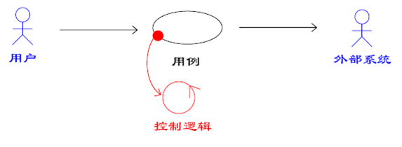
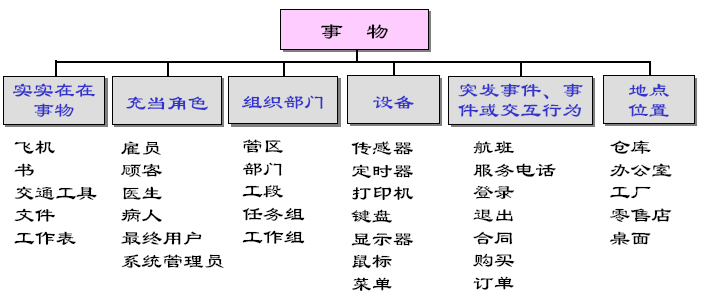

# 第六章 面向对象分析

面向对象分析过程

- 获取需求

  - 与用户交谈，向用户提问题；
  - 参观用户的工作流程，观察用户的操作；
  - 向用户群体发调查问卷；
  - 与同行、专家交谈，听取他们的意见；
  - 分析已经存在的同类软件产品，提取需求；
  - 从行业标准、规则中提取需求；
  - 从Internet上搜查相关资料等。

- 整理需求

  - 书写需求陈述：需求陈述内容包括问题范围，功能需求，性能需求，应用环境及假设条件。

- 建立模型

  - 抽取整理用户需求建立问题域精确模型。

    面向对象分析模型由三个独立模型组成：

    - 功能模型：用例图

      1. 识别外部执行者；
      2. 识别用例；
      3. 建立用例图；
      4. 补充用例描述：为建立对象模型和动态模型打基础。

    - 对象模型：类图和对象图

      1. 确定分析类；

         1. 找出候选分析类：边界类、控制类、实体类

            **确定边界类：**通常，一参与者与一用例间交互或通信关联对应一边界类。

            

            **识别控制类：**控制类负责协调边界类和实体类，通常在现实世界没有对应的事物。一般来说，一个用例对应一个控制类。

            

            **识别实体类：**实体类通常是用例中的参与对象，对应这现实世界中”事物“

            

      2. 确定类的关联；

         1. 初步确定关联

            动词或动词词组；

            隐含关联；

            与用户及领域专家讨论补充

         2. 筛选

            已删去类之间关联

            删掉某候选类，与这个类有关的关联也删去，或重新表达。

         3. 进一步完善

      3. 划分主题；

      4. 确定属性；

         1. 误把类当属性
         2. 误把链属性作为属性
         3. 误把限定当属性
         4. 误把内部状态当属性
         5. 过于细化
         6. 存在不一致属性

      5. 识别继承；

      6. 反复修改。

    - 动态模型：状态图和顺序图。

      1. 编写脚本：脚本描述用户与目标系统间的一个或多个典型交互过程。
         1. 正常情况脚本
         2. 异常情况脚本
         3. 错误情况脚本
      2. 画顺序图：从脚本提取所有外部事件，确定每类事件发送和接受对象。针对系统中的典型功能，画出顺序图。
      3. 画状态图：用一张状态图描述类的行为，集中考虑具有交互行为类。

- 书写需求规格说明书

- 复审

